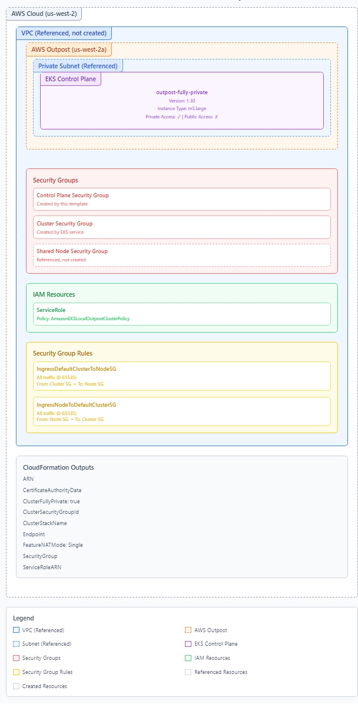

# CloudFormation Templates for Amazon EKS Local Clusters on AWS Outposts

This CFN template only creates the Amazon EKS Local Clusters on AWS Outposts - Control Plane (default 3 control plane nodes)

## Components Created by the EKS Cluster CloudFormation Template

This CloudFormation template creates an Amazon EKS Local cluster on AWS Outpost. Here's a comprehensive list of all components it creates:

## IAM Resources

1. **ServiceRole**
   - Type: `AWS::IAM::Role`
   - Purpose: IAM role for the EKS control plane
   - Policy: AmazonEKSLocalOutpostClusterPolicy
   - Trust Relationship: EC2 service principal (mapped based on AWS partition)

## Security Groups

2. **ControlPlaneSecurityGroup**
   - Type: `AWS::EC2::SecurityGroup`
   - Purpose: Controls communication between control plane and worker nodes
   - VPC: Uses the provided VpcId parameter

## Security Group Rules

3. **IngressDefaultClusterToNodeSG**
   - Type: `AWS::EC2::SecurityGroupIngress`
   - Purpose: Allows all traffic from cluster security group to node security group
   - Protocol: All (-1)
   - Port Range: 0-65535
   - Source: EKS cluster security group
   - Destination: Shared node security group (from parameter)

4. **IngressNodeToDefaultClusterSG**
   - Type: `AWS::EC2::SecurityGroupIngress`
   - Purpose: Allows all traffic from node security group to cluster security group
   - Protocol: All (-1)
   - Port Range: 0-65535
   - Source: Shared node security group (from parameter)
   - Destination: EKS cluster security group

## EKS Resources

5. **ControlPlane**
   - Type: `AWS::EKS::Cluster`
   - Purpose: The EKS Local cluster on Outpost
   - Key Properties:
     - Authentication Mode: CONFIG_MAP
     - Bootstrap Admin Permissions: Enabled
     - Kubernetes Version: From parameter (1.28-1.31)
     - Outpost Configuration:
       - Instance Type: From parameter (m5.large, c5.large, etc.)
       - Outpost ARN: From parameter
     - VPC Configuration:
       - Private Endpoint: Enabled
       - Public Endpoint: Disabled
       - Security Groups: ControlPlaneSecurityGroup
       - Subnets: PrivateSubnetId from parameter

## CloudFormation Outputs

6. **ARN**
   - Value: Cluster ARN
   - Exported as `${StackName}::ARN`

7. **CertificateAuthorityData**
   - Value: Cluster certificate authority data
   - Not exported

8. **ClusterFullyPrivate**
   - Value: true
   - Exported as `${StackName}::ClusterFullyPrivate`

9. **ClusterSecurityGroupId**
   - Value: Security group ID created by EKS
   - Exported as `${StackName}::ClusterSecurityGroupId`

10. **ClusterStackName**
    - Value: Current stack name
    - Not exported

11. **Endpoint**
    - Value: Cluster API server endpoint
    - Exported as `${StackName}::Endpoint`

12. **FeatureNATMode**
    - Value: Single
    - Not exported

13. **SecurityGroup**
    - Value: ControlPlaneSecurityGroup ID
    - Exported as `${StackName}::SecurityGroup`

14. **ServiceRoleARN**
    - Value: IAM role ARN for cluster
    - Exported as `${StackName}::ServiceRoleARN`

## Additional Configurations

15. **ServicePrincipalPartitionMap**
    - Type: CloudFormation Mapping
    - Purpose: Maps service principals across different AWS partitions
    - Includes mappings for different AWS regions (standard, China, GovCloud, etc.)

This template creates a fully private EKS Local cluster on AWS Outpost with no public internet access, using the networking infrastructure that must be provided as parameters.

## Key Considerations for Fully Private EKS on Outpost

### Accessing the Kubernetes API
- **Bastion Host Required**: Deploy a bastion host in the same VPC to access the Kubernetes API endpoint
- **VPN/Direct Connect**: Establish private connectivity from your network to the VPC using Site-to-Site VPN or Direct Connect
- **Local Kubeconfig**: Generate kubeconfig on machines with VPC connectivity using `aws eks update-kubeconfig`
- **IAM Authentication**: All API calls require proper IAM permissions despite being in a private network

### Adding Worker Nodes
- **Node Capacity Planning**: Outpost has fixed physical capacity; plan node scaling limits accordingly
- **Self-Managed Nodes**: Use EC2 launch templates with the Outpost ARN specified
- **AMI Considerations**: Use EKS-optimized AMIs pre-cached on the Outpost
- **Instance Storage**: Limited local storage options compared to region-based clusters
- **Managed Node Groups**: Not supported on AWS Outposts. Use self-managed nodes

### Networking Considerations
- **Pod Networking**: CNI plugin uses local IP space; ensure adequate subnet sizing
- **Service Connectivity**: Services only accessible within the cluster or via private network
- **Load Balancing**: No AWS Load Balancer Controller for public-facing services; use internal NLBs
- **Ingress Traffic**: Must design custom ingress solutions using internal load balancers
- **Egress Traffic**: Workloads can only access resources within VPC or via VPC endpoints

### Operations and Maintenance
- **Control Plane Upgrades**: Plan for downtime during control plane upgrades
- **Backup Strategy**: Implement Velero or similar with S3 VPC endpoint access
- **Log Collection**: Configure audit logs and control plane logs to flow to CloudWatch via endpoints
- **Monitoring**: Deploy Prometheus/Grafana stack within cluster for observability
- **Limited AWS Console**: Console operations require connectivity to the private endpoint

### Resilience Challenges
- **Single Outpost Limitation**: No multi-AZ capability for control plane
- **Outpost-AWS Link**: Service Link interruptions may impact cluster management functions
- **Disaster Recovery**: Create DR plans for potential Outpost hardware failures
- **Application Patterns**: Design applications for single-AZ tolerance with proper replication

### Compliance and Security
- **Encryption**: Use KMS via VPC endpoints for secret encryption
- **Private Registry**: Set up local container registry on Outpost or ECR via endpoint
- **Image Scanning**: Deploy in-cluster scanning tools due to limited online scanning
- **Pod Security**: Implement PSPs/PSS for enhanced workload isolation
- **Network Policies**: Deploy Calico or similar for micro-segmentation

### Cost Considerations
- **Outpost Fixed Costs**: Outpost capacity has fixed costs regardless of EKS usage
- **Control Plane Pricing**: Additional charges for control plane nodes on Outpost
- **Data Transfer**: Intra-Outpost data transfer is free but consider VPC endpoint costs
